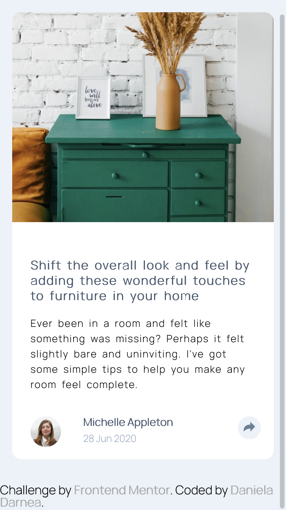

# Frontend Mentor - Article preview component solution

This is a solution to the [Article preview component challenge on Frontend Mentor](https://www.frontendmentor.io/challenges/article-preview-component-dYBN_pYFT). Frontend Mentor challenges help you improve your coding skills by building realistic projects.

## Table of contents

- [Overview](#overview)
  - [The challenge](#the-challenge)
  - [Screenshot](#screenshot)
  - [Links](#links)
- [My process](#my-process)
  - [Built with](#built-with)
  - [What I learned](#what-i-learned)
- [Author](#author)

## Overview

### The challenge

Users should be able to:

- View the optimal layout for the component depending on their device's screen size
- See the social media share links when they click the share icon

### Screenshot

### Links

- Solution URL: [Repo](https://github.com/mdanieladla/preview-component)
- Live Site URL: [Live site](https://mdanieladla.github.io/preview-component/)

## My process

### Built with

- Semantic HTML5 markup
- CSS custom properties
- Flexbox
- CSS Grid
- Mobile-first workflow
- Javascript

### What I learned

With this challenge I have improved my layout skills (HTML5, CSS3) and basic JS.
This is the first version of the challenge and that is why is not finished the desktop version (yet).

## Author

- Website - [Daniela Darnea](https://mdanieladla.github.io/portfolio/)
- Frontend Mentor - [@mdanieladla](https://www.frontendmentor.io/profile/mdanieladla)
